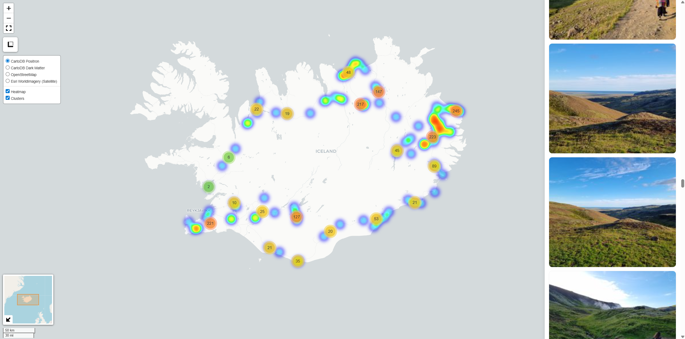

<!---
README.md for the `photomap` repository.
-->

<!-- PROJECT INFO -->
[![Contributors][contributors-shield]][contributors-url]
[![Forks][forks-shield]][forks-url]
[![Stargazers][stars-shield]][stars-url]
[![Issues][issues-shield]][issues-url]
[![License][license-shield]][license-url]

<!-- PROJECT LOGO -->
<br />
<div align="center">
  <a href="https://github.com/alexanderblinn/photomap">
    
  </a>

  <h3 align="center">photomap</h3>

  <p align="center">
    Short project description goes here.
    <br />
    <a href="https://github.com/alexanderblinn/photomap"><strong>Explore the docs »</strong></a>
    <br />
    <br />
    <a href="https://github.com/alexanderblinn/photomap">View Demo</a>
    ·
    <a href="https://github.com/alexanderblinn/photomap/issues">Report Bug</a>
    ·
    <a href="https://github.com/alexanderblinn/photomap/issues">Request Feature</a>
  </p>
</div>

---

<!-- TABLE OF CONTENTS -->
<details>
  <summary>Table of Contents</summary>
  <ol>
    <li><a href="#about-the-project">About The Project</a></li>
    <li><a href="#getting-started">Getting Started</a></li>
    <li><a href="#usage">Usage</a></li>
    <li><a href="#contributing">Contributing</a></li>
    <li><a href="#license">License</a></li>
    <li><a href="#contact">Contact</a></li>
  </ol>
</details>

---

<!-- ABOUT THE PROJECT -->
## About The Project

Describe what your project does, why it exists, and what makes it unique.  
Provide context or background if relevant.

<p align="right">(<a href="#readme-top">back to top</a>)</p>

---

<!-- GETTING STARTED -->
## Getting Started

Instructions for setting up the project locally. Example:

### Prerequisites
- Node.js
- Python
- Docker

### Installation
```bash
git clone https://github.com/alexanderblinn/photomap.git
cd photomap
# install dependencies
```

<p align="right">(<a href="#readme-top">back to top</a>)</p>

---

<!-- USAGE EXAMPLES -->
## Usage

Show examples of how to use your project.  
Add code snippets, screenshots, or links to the documentation.

_For more examples, see the [Documentation](https://github.com/alexanderblinn/photomap/wiki)._

<p align="right">(<a href="#readme-top">back to top</a>)</p>

---

<!-- CONTRIBUTING -->
## Contributing

Contributions are **welcome**!  
Follow these steps to contribute:

1. Fork the project
2. Create your feature branch (`git checkout -b feature/AmazingFeature`)
3. Commit your changes (`git commit -m 'Add some AmazingFeature'`)
4. Push to the branch (`git push origin feature/AmazingFeature`)
5. Open a Pull Request

<p align="right">(<a href="#readme-top">back to top</a>)</p>

---

<!-- LICENSE -->
## License

Distributed under the MIT License. See `LICENSE` for more information.

<p align="right">(<a href="#readme-top">back to top</a>)</p>

---

<!-- CONTACT -->
## Contact

Your Name – [your.email@example.com](mailto:your.email@example.com)  
Project Link: [https://github.com/alexanderblinn/photomap](https://github.com/alexanderblinn/photomap)

<p align="right">(<a href="#readme-top">back to top</a>)</p>

---

<!-- MARKDOWN LINKS & IMAGES -->
<!-- Replace `photomap` everywhere below -->
[contributors-shield]: https://img.shields.io/github/contributors/alexanderblinn/photomap.svg?style=for-the-badge
[contributors-url]: https://github.com/alexanderblinn/photomap/graphs/contributors
[forks-shield]: https://img.shields.io/github/forks/alexanderblinn/photomap.svg?style=for-the-badge
[forks-url]: https://github.com/alexanderblinn/photomap/network/members
[stars-shield]: https://img.shields.io/github/stars/alexanderblinn/photomap.svg?style=for-the-badge
[stars-url]: https://github.com/alexanderblinn/photomap/stargazers
[issues-shield]: https://img.shields.io/github/issues/alexanderblinn/photomap.svg?style=for-the-badge
[issues-url]: https://github.com/alexanderblinn/photomap/issues
[license-shield]: https://img.shields.io/github/license/alexanderblinn/photomap.svg?style=for-the-badge
[license-url]: https://github.com/alexanderblinn/photomap/blob/main/LICENSE
